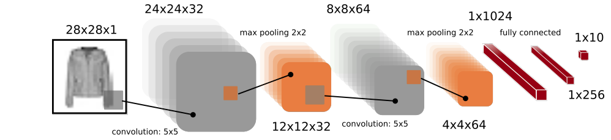
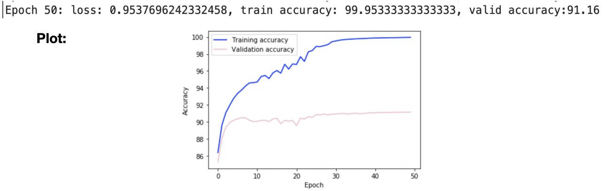

# Convolutional-Neural-Network-Fashion_MNIST
Deep Learning CNN for clothing classification using Fashion MNIST dataset
Neural Network was implemented using Python and PyTorch.

The NN was implemented following the architecture below. 

The model uses a cross entropy loss function and SGD as optimisation method. Weights are initialized using the Xavier normal initialization. 

Trained the model for 50 epochs with the following activation functions: Sigmoid, reLU and Tanh.

<b>Results:</b> 
<b>Activation Function: Tanh
Learning rate: 0.1

